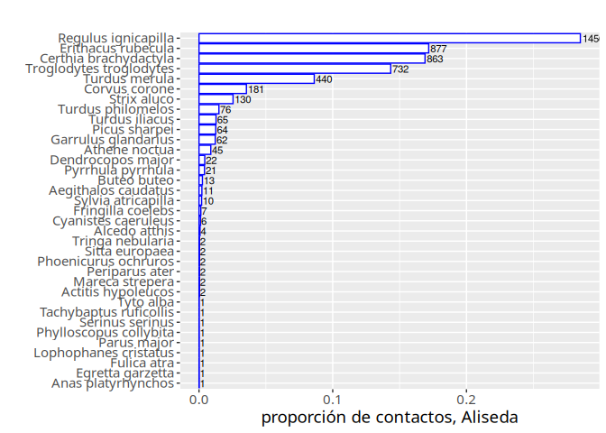

Procesado básico de salidas de BirdNET-Analyzer
================
Mario Quevedo
Febrero de 2025

## Procesado de datos del entorno de la Aliseda Cantábrica (JBA, Gijón)

Carga librerías, y si es necesario las instala

``` r
if (!require("dplyr")) install.packages("dplyr"); library(dplyr)
if (!require("ggplot2")) install.packages("ggplot2"); library(ggplot2)
if (!require("lubridate")) install.packages("lubridate"); library(lubridate)
if (!require("gridExtra")) install.packages("gridExtra"); library(gridExtra)
if (!require("xkcd")) install.packages("xkcd"); library(xkcd)
if (!require("extrafont")) install.packages("extrafont"); library(extrafont)
```

Carga los datos desde un RData (incluye las 4 localidades)

``` r
load("botanico_202312_202402_v24.RData")
names(aliseda)
```

    ##  [1] "filename"        "start"           "end"             "scientific_name"
    ##  [5] "common_name"     "auditado"        "aceptado"        "confidence"     
    ##  [9] "date"            "file_time"       "time_utc"        "time"           
    ## [13] "duration"        "local"

Eliminando columnas sobrantes

``` r
str(aliseda) 
aliseda <- aliseda[,c(1:8)]
```

``` r
head(aliseda)
```

    ## # A tibble: 6 × 8
    ##   filename  start   end scientific_name common_name auditado aceptado confidence
    ##   <chr>     <dbl> <dbl> <chr>           <chr>          <dbl>    <dbl>      <dbl>
    ## 1 20240127…  1077  1080 Accipiter nisus Eurasian S…       NA       NA      0.427
    ## 2 20231228…  2880  2883 Accipiter nisus Eurasian S…       NA       NA      0.119
    ## 3 20240126…   585   588 Accipiter nisus Eurasian S…       NA       NA      0.118
    ## 4 20240118…   816   819 Accipiter nisus Eurasian S…       NA       NA      0.108
    ## 5 20240128…   945   948 Actitis hypole… Common San…        1        1      0.741
    ## 6 20231224…  4794  4797 Actitis hypole… Common San…        1        1      0.700

### Manipulando las horas y duraciones con la librería *lubridate*

``` r
head(aliseda$filename)
```

    ## [1] "20240127_103200T.WAV" "20231228_170000T.WAV" "20240126_103200T.WAV"
    ## [4] "20240118_090100T.WAV" "20240128_090100T.WAV" "20231224_093010T.WAV"

``` r
aliseda$date <- paste(substr(aliseda$filename,1,4),'-', substr(aliseda$filename,5,6),'-',
                      substr(aliseda$filename,7,8))
head(aliseda$date)
```

    ## [1] "2024 - 01 - 27" "2023 - 12 - 28" "2024 - 01 - 26" "2024 - 01 - 18"
    ## [5] "2024 - 01 - 28" "2023 - 12 - 24"

``` r
aliseda$date <- ymd(aliseda$date) #formato interno años, meses, días
head(aliseda$date)
```

    ## [1] "2024-01-27" "2023-12-28" "2024-01-26" "2024-01-18" "2024-01-28"
    ## [6] "2023-12-24"

``` r
aliseda$file_time <- paste(substr(aliseda$filename,10,11),':', substr(aliseda$filename,12,13),
                           ':',substr(aliseda$filename,14,15))
head(aliseda$file_time)
```

    ## [1] "10 : 32 : 00" "17 : 00 : 00" "10 : 32 : 00" "09 : 01 : 00" "09 : 01 : 00"
    ## [6] "09 : 30 : 10"

``` r
aliseda$file_time <- hms(aliseda$file_time) # formato interno horas, minutos, segundos

offset <- seconds_to_period(aliseda$start)
head(offset)
```

    ## [1] "17M 57S"    "48M 0S"     "9M 45S"     "13M 36S"    "15M 45S"   
    ## [6] "1H 19M 54S"

``` r
aliseda$time_utc <- aliseda$file_time + offset
aliseda$time <- aliseda$time_utc + hours(1)
```

### Inspección de los datos

``` r
aliseda$duration <- aliseda$end-aliseda$start
(horas.detectando.aliseda <- sum(aliseda$duration)/3600) 
```

    ## [1] 25.40417

``` r
tapply(aliseda$duration, aliseda$scientific_name, sum)
```

### Filtrando nivel de confianza de la identificación BirdNET

``` r
aliseda.60 <- subset(aliseda, aliseda$confidence >= 0.60)
aliseda.60.audit <- subset(aliseda.60, aliseda.60$aceptado == 1)
```

### Construyendo un resumen de los datos

``` r
names(aliseda.60)
(duration.aliseda <- aggregate(duration ~ scientific_name, aliseda.60, sum))
(confidence.aliseda <- aggregate(confidence ~ scientific_name, aliseda.60, max))

resumen.aliseda <- merge(duration.aliseda, confidence.aliseda)
head(resumen.aliseda)
resumen.aliseda$contactos <- resumen.aliseda$duration / 3
resumen.aliseda$duration <- NULL
resumen.aliseda$especie <- resumen.aliseda$scientific_name
resumen.aliseda$scientific_name <- NULL
resumen.aliseda$props <- resumen.aliseda$contactos / sum(resumen.aliseda$contactos)
resumen.aliseda$orden <- rank(resumen.aliseda$contactos, ties.method="first")
```

``` r
(resumen.aliseda <- resumen.aliseda[order(resumen.aliseda$orden, decreasing = T),])
```

    ##    confidence contactos                 especie        props orden
    ## 24     0.9999      1456     Regulus ignicapilla 0.2851547199    35
    ## 12     0.9987       877      Erithacus rubecula 0.1717587152    34
    ## 7      0.9991       863   Certhia brachydactyla 0.1690168429    33
    ## 31     0.9991       732 Troglodytes troglodytes 0.1433607521    32
    ## 33     0.9975       440           Turdus merula 0.0861731297    31
    ## 8      0.9426       181           Corvus corone 0.0354484920    30
    ## 27     0.9991       130             Strix aluco 0.0254602429    29
    ## 34     0.9564        76       Turdus philomelos 0.0148844497    28
    ## 32     0.9860        65          Turdus iliacus 0.0127301214    27
    ## 22     0.9978        64           Picus sharpei 0.0125342734    26
    ## 15     0.9838        62     Garrulus glandarius 0.0121425774    25
    ## 5      0.9934        45           Athene noctua 0.0088131610    24
    ## 10     0.9331        22       Dendrocopos major 0.0043086565    23
    ## 23     0.9644        21       Pyrrhula pyrrhula 0.0041128085    22
    ## 6      0.9588        13             Buteo buteo 0.0025460243    21
    ## 2      0.9933        11     Aegithalos caudatus 0.0021543282    20
    ## 28     0.8247        10      Sylvia atricapilla 0.0019584802    19
    ## 13     0.8201         7       Fringilla coelebs 0.0013709362    18
    ## 9      0.9845         6     Cyanistes caeruleus 0.0011750881    17
    ## 3      0.9668         4           Alcedo atthis 0.0007833921    16
    ## 30     0.8185         2        Tringa nebularia 0.0003916960    15
    ## 26     0.7539         2          Sitta europaea 0.0003916960    14
    ## 20     0.7120         2    Phoenicurus ochruros 0.0003916960    13
    ## 19     0.6794         2          Periparus ater 0.0003916960    12
    ## 17     0.8256         2         Mareca strepera 0.0003916960    11
    ## 1      0.7407         2      Actitis hypoleucos 0.0003916960    10
    ## 35     0.8918         1               Tyto alba 0.0001958480     9
    ## 29     0.6915         1  Tachybaptus ruficollis 0.0001958480     8
    ## 25     0.8518         1         Serinus serinus 0.0001958480     7
    ## 21     0.9018         1  Phylloscopus collybita 0.0001958480     6
    ## 18     0.9927         1             Parus major 0.0001958480     5
    ## 16     0.8676         1   Lophophanes cristatus 0.0001958480     4
    ## 14     0.6602         1             Fulica atra 0.0001958480     3
    ## 11     0.6309         1        Egretta garzetta 0.0001958480     2
    ## 4      0.6141         1      Anas platyrhynchos 0.0001958480     1

**Conversión del resumen a formato ancho, para posteriormente usar
libreria** *vegan*

``` r
head(resumen.aliseda)
```

    ##    confidence contactos                 especie      props orden
    ## 24     0.9999      1456     Regulus ignicapilla 0.28515472    35
    ## 12     0.9987       877      Erithacus rubecula 0.17175872    34
    ## 7      0.9991       863   Certhia brachydactyla 0.16901684    33
    ## 31     0.9991       732 Troglodytes troglodytes 0.14336075    32
    ## 33     0.9975       440           Turdus merula 0.08617313    31
    ## 8      0.9426       181           Corvus corone 0.03544849    30

``` r
resumen.aliseda.ancho <- resumen.aliseda[,c(2,3)]
resumen.aliseda.ancho <- tidyr::pivot_wider(resumen.aliseda.ancho, names_from = "especie",
                                            values_from = "contactos")
head(resumen.aliseda.ancho)
```

    ## # A tibble: 1 × 35
    ##   `Regulus ignicapilla` `Erithacus rubecula` `Certhia brachydactyla`
    ##                   <dbl>                <dbl>                   <dbl>
    ## 1                  1456                  877                     863
    ## # ℹ 32 more variables: `Troglodytes troglodytes` <dbl>, `Turdus merula` <dbl>,
    ## #   `Corvus corone` <dbl>, `Strix aluco` <dbl>, `Turdus philomelos` <dbl>,
    ## #   `Turdus iliacus` <dbl>, `Picus sharpei` <dbl>, `Garrulus glandarius` <dbl>,
    ## #   `Athene noctua` <dbl>, `Dendrocopos major` <dbl>,
    ## #   `Pyrrhula pyrrhula` <dbl>, `Buteo buteo` <dbl>,
    ## #   `Aegithalos caudatus` <dbl>, `Sylvia atricapilla` <dbl>,
    ## #   `Fringilla coelebs` <dbl>, `Cyanistes caeruleus` <dbl>, …

### Métrica estándar de diversidad con *vegan*

``` r
(simpsonD.aliseda <- vegan::diversity (resumen.aliseda.ancho, index="invsimpson"))
```

    ## [1] 5.879403

``` r
((riqueza.aliseda <- vegan::specnumber(resumen.aliseda.ancho)))
```

    ## [1] 35

``` r
(equita.aliseda <- simpsonD.aliseda / riqueza.aliseda)
```

    ## [1] 0.1679829

### Gráficos de barras

``` r
(aliseda.barras <- aliseda.barras + coord_flip())
```

<!-- -->
